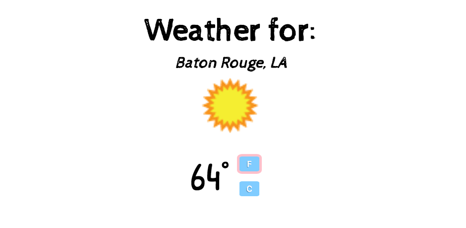
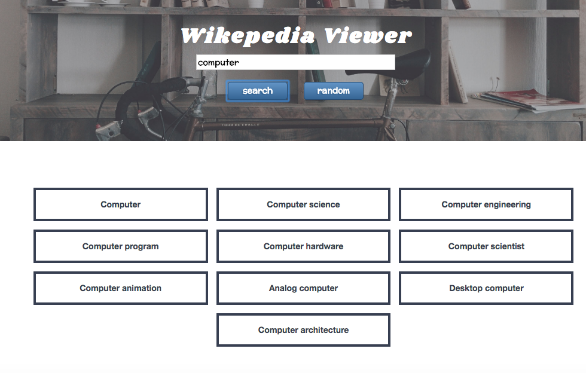

# free code camp projects 

These are some of the Free Code Camp projects I completed for the front-end development section.

[## 1. Tribute Page](https://github.com/mary-chapman/free-code-camp-projects/tree/master/tribute-page)

## 2. Quote Machine

## 3. Weather App

## 4.  Wikipedia Viewer 

## 5. Clock

## 6. Simon

## 7.Tic-Tac-Toe

## 8. Twitch Viewer

